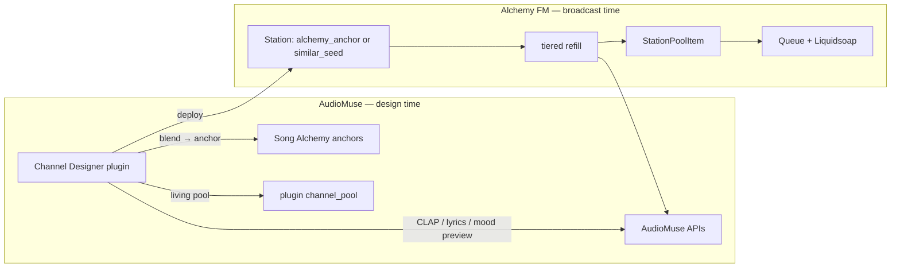

# Alchemy FM Channel Designer — Backlog & Gap Analysis

Living document for planned work on the **Alchemy FM Channel Designer** plugin (`alchemy_fm_bridge`), Alchemy FM backend integration, and related UX/ops gaps.

Last updated: 2026-07-09 (through plugin v2.3.2).

---

## Architecture snapshot



**Design happens in AudioMuse. Broadcast happens in Alchemy FM.**

The plugin previews five programming modes (CLAP, lyrics, mood, anchor, seed) but only deploys two backend-native source types (`alchemy_anchor`, `similar_seed`). CLAP, lyrics, and mood are compiled into a Song Alchemy anchor at deploy time.

---

## What is fully implemented (v2.3.x)

| Capability | Notes |
|------------|-------|
| CLAP / lyrics / mood / anchor / seed **preview** | Via AudioMuse APIs |
| Preview enrichment | Tempo, energy, mood via `get_score_data_by_ids()` |
| Tempo / energy **filters** | Applied to preview, push, living auto-add, cron |
| **Deploy bridge** | Preview → anchor (if needed) → Alchemy FM station |
| **Edit / delete stations** | GET `?edit=slug`, card grid, admin API |
| **Channel profiles** | `profile_json` in plugin `channels` table |
| **Audition history** | Last runs per channel (timestamp + count) |
| **Living hooks** | `on_song_analyzed` + `refresh_living` cron registered |
| **Worker-safe API URL** | Plugin setting + env fallback for cron/hooks |
| **Station list UI** | Card grid, edit toolbar, badges (v2.3.1+) |
| **Generic setup examples** | No live hostnames in settings/README (v2.3.2+) |

---

## Tier 1 — Half-built (priority to finish)

### 1. Living channels — pool is write-only

**Status:** Hooks work; pool does not drive programming.

- `_pool_item_ids()` exists but is **never called**
- Cron re-runs original programming query; does not merge accumulated pool
- Plugin `channel_pool` (AudioMuse DB) ≠ Alchemy FM `StationPoolItem` (two separate pools)
- `on_song_analyzed` adds tracks but does not refresh Alchemy FM until nightly cron (if `auto_refresh_alchemy` enabled)
- UI says “re-score pool” but behavior is “re-run programming + append to pool”

**To finish:**

- [ ] Consume pool in preview / push / cron (merge pool IDs with programming results)
- [ ] Optionally sync plugin pool → Alchemy FM bootstrap or `StationPoolItem`
- [ ] “Refresh queue now” from plugin (`POST .../refresh-queue`)
- [ ] Optional: immediate Alchemy FM update after `on_song_analyzed` (or debounced)

### 2. Edit round-trip loses original programming

**Status:** Remote-only stations lose CLAP/lyrics/mood context on edit.

- Stations deployed from CLAP/lyrics/mood but never saved locally load as `alchemy_anchor: {id}` only
- Original query, filters, and living settings are lost unless local `channels` row exists

**To finish:**

- [ ] Always `_save_channel()` full profile on deploy (including remote-first deploys)
- [ ] Optional: store `profile_json` or programming metadata on Alchemy FM `Station` model

### 3. Audition history — counts only

**Status:** `track_ids_json` stored; UI shows when / channel / count only.

- [ ] Expandable row or drill-down listing tracks per audition run

---

## Tier 2 — Roadmap (v2.4+, not started)

From `audiomuse-plugins/README.md` and AudioMuse Radio channel programming vision:

| Feature | Description | Depends on |
|---------|-------------|------------|
| **Navidrome bootstrap playlists** | Optional opener via `create_or_replace_playlist`; ongoing programming from intelligence queries | Plugin `tasks.mediaserver` |
| **Direct `clap_query` / `lyrics_query` on Alchemy FM** | No anchor bridge; backend calls CLAP/lyrics on refill | New `SourceType` values + `audiomuse.py` |
| **Formal channel programming profile** | `bootstrap` + `programming` + `refresh` + `filters` as first-class model | Plugin + optional backend fields |
| **Genre / mood filters on refill** | Beyond tempo/energy; needs AudioMuse search/criteria API exposure | AudioMuse wrapper or public criteria API |
| **Mood centroid as live source** | Similar to CLAP/lyrics direct path | Backend + AudioMuse |

### Planned programming source types (AudioMuse Radio vision)

1. `clap_query` — POST `/api/clap/search`
2. `lyrics_query` — POST `/api/lyrics/search/text`
3. `mood_centroid` — GET `/api/similar_tracks` with mood + centroid_index
4. `alchemy_anchor` — POST `/api/alchemy`
5. `similar_seed` — similar tracks from seed
6. `navidrome_playlist` — bootstrap only (optional)
7. Refresh: `similar_last_played`, fallback to programming query

**Do not use** `/api/chatPlaylist` for 24/7 refresh (LLM, slow). OK for one-time channel design.

---

## Tier 3 — Backend exists; plugin does not expose

| Capability | Backend | Plugin | Alchemy admin UI |
|------------|---------|--------|------------------|
| Station artwork upload | ✅ | ❌ | ✅ |
| Rebuild M3U | ✅ | ❌ | ❌ (docs / startup only) |
| Manual queue refresh | ✅ | ❌ (cron only) | ✅ Queue button |
| Full station rebuild (bootstrap) | ✅ | partial (deploy checkbox) | ✅ Rebuild button |
| `source_last_error` detail | ✅ | ❌ | health pill only |
| Broadcast / appearance settings | ✅ | ❌ | ✅ |
| Knowledge enrichment admin | ✅ | ❌ | ✅ |
| Navidrome heart / playlists | ✅ | ❌ | ✅ (listener UI) |
| Pool stats (`pool_count`, `buffer_minutes`) | ✅ | queue count only | ✅ |

**Plugin operator gaps:**

- [ ] Upload / remove station artwork
- [ ] Rebuild station (full bootstrap) from edit toolbar
- [ ] Refresh queue now
- [ ] Show refill errors (`source_last_error`) on station cards
- [ ] Toggle on-air without full redeploy

---

## Tier 4 — UX / product gaps

- [ ] **Duplicate channel** — fork settings/programming to new slug
- [ ] **A/B preview** — compare two CLAP/lyrics queries before deploy
- [ ] **Station health dashboard** — on-air, queued, pool, last error, living pool in one view
- [ ] **Continuation mode alignment** — plugin defaults `similar_to_last`; admin UI defaults `source_only`
- [ ] **Remote-only recovery** — guided flow when “Alchemy FM only” badge shown (re-link programming)
- [ ] **Delete cleanup** — remove plugin pool/audition rows; optional AudioMuse anchor cleanup (`AFM: {name}`)
- [ ] **Anchor orphan management** — track anchor IDs created per channel; update vs create on redeploy

---

## Tier 5 — Ops / infrastructure

- [ ] **Worker URL required** for living cron — document prominently; fail loudly if unreachable
- [ ] **Legacy stations** — old `source_type` values (`clap_query`, `navidrome_playlist`, `clustering_playlist`) auto-disabled until reconfigured
- [ ] **Cloudflare / server-to-server** — plugin needs LAN URL or WAF skip for `/api/admin/*` when public URL blocks AudioMuse container
- [ ] **Two-container plugin install** — Flask + worker both need plugin; living features require worker target (not `targets: ["flask"]` only)

### Setup examples (public docs)

Use **generic placeholders only** in plugin settings and README:

- Alchemy FM public: `https://alchemyfm.example.com`
- Alchemy FM LAN: `http://192.168.1.100:8080` (or host-published backend port)
- AudioMuse worker URL: `http://192.168.1.100:8387`

Do not commit operator-specific hostnames (e.g. production domains or home LAN IPs) into plugin source.

---

## Backend reference (Alchemy FM)

### Active source types

```text
alchemy_anchor   → POST /api/alchemy
similar_seed     → GET /api/similar_tracks?item_id=
```

### Tiered refill (`refill.py`)

| Tier | When | Source |
|------|------|--------|
| 0 | Always (best-effort) | Programming batch from `source_type` / `source_ref` |
| 1 | If short | `StationPoolItem` reuse |
| 1b | `continuation_mode == source_only` | Pool repeats |
| 2 | Not `source_only` | Identity anchor |
| 3 | Not `source_only` | Similar to identity seed |
| 4 | `similar_to_last` | Similar to last played |

### Key admin API endpoints (plugin uses subset)

| Method | Path | Plugin uses |
|--------|------|-------------|
| GET/POST/PUT/DELETE | `/api/admin/stations` | ✅ |
| POST | `/api/admin/stations/{id}/bootstrap` | ✅ (deploy) |
| POST | `/api/admin/stations/{id}/refresh-queue` | partial (living cron) |
| POST | `/api/admin/stations/{id}/rebuild-m3u` | ❌ |
| POST | `/api/admin/stations/{id}/artwork` | ❌ |

---

## Suggested priority order

1. **Finish living channels** — pool consumption + optional Alchemy FM sync + refresh-queue button
2. **Profile persistence on every deploy** — never lose CLAP/lyrics/mood on edit
3. **Operator tools in plugin** — rebuild, refresh, errors, artwork
4. **Navidrome bootstrap opener** — playlist cold start
5. **Direct CLAP/lyrics on Alchemy FM backend** — removes anchor drift over time

---

## Dead code / cleanup (non-urgent)

| Item | Location | Notes |
|------|----------|-------|
| `_pool_item_ids()` | `__init__.py` | Unused; intended for pool-driven programming |
| `profiles` table | plugin migrate | v1 legacy; never read/written |
| `alchemy_client.py` | plugin folder | Orphan; `__init__.py` inlines client |

---

## Version history (plugin)

| Version | Highlights |
|---------|------------|
| 2.3.2 | Generic setup examples; fix plugin.json 2.3.0 entry |
| 2.3.1 | Station card grid, edit toolbar, GET edit links |
| 2.3.0 | Living channels, filters, audition history, worker support |
| 2.2.0 | List/edit/delete all Alchemy FM stations |
| 2.1.0 | Edit saved channels, update by slug |
| 2.0.x | Channel Designer pivot (CLAP, lyrics, moods, preview, deploy) |

Pre-v2 catalog entries removed from `plugin.json` (rollback only to 2.0.0+).

---

## Related docs

- [audiomuse-plugins/README.md](../audiomuse-plugins/README.md) — install, workflow, living channels setup
- [docs/TECH_DEBT.md](TECH_DEBT.md) — backend technical debt
- [docs/TRAEFIK.md](TRAEFIK.md) — LAN backend port for plugin API access
